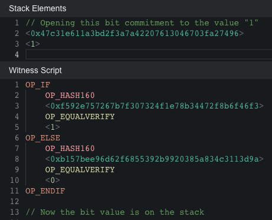
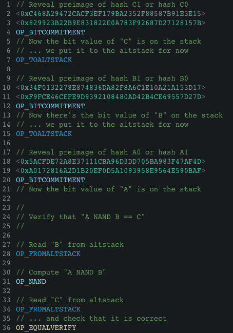
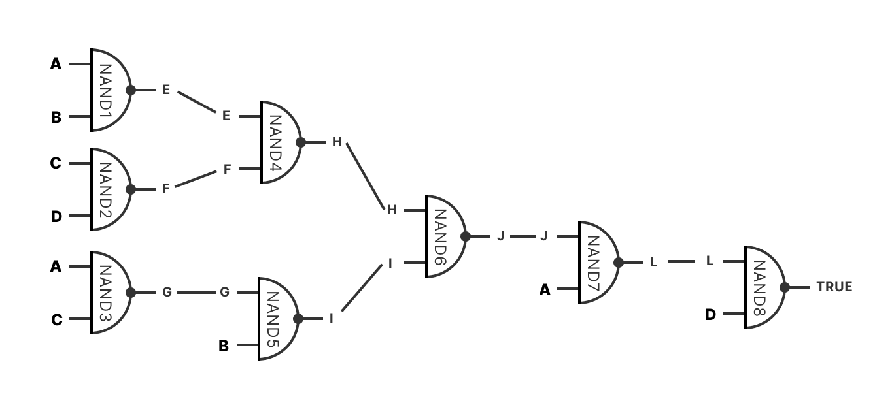
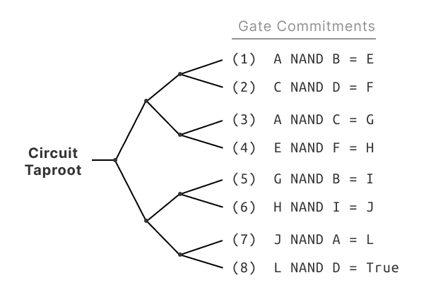
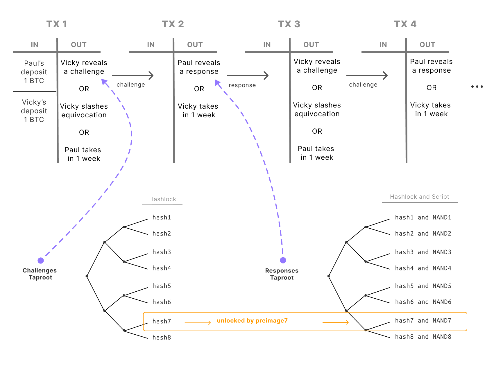
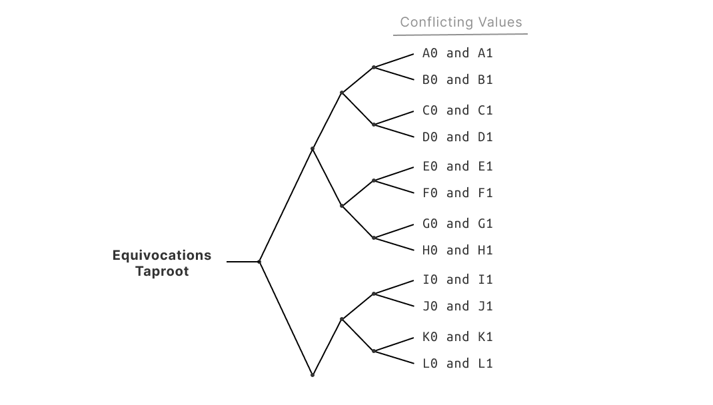

# BITVM：在比特币上进行任何计算

​								作者：Robin Linus
​							   robin@zerosync.org
​								[www.bitvm.org](https://bitvm.org/) 
​								2023.12.12

​								中文翻译：Bitlayer
​								[bitlayer.org](https://bitlayer.org/) 
​								2023.12.12

  <strong>概要 (Abstract)</strong>

BitVM is a computing paradigm to express Turing-complete Bitcoin contracts. This requires no changes to the network's consensus rules. Rather than executing computations on Bitcoin, they are merely verified, similarly to optimistic rollups. A prover makes a claim that a given function evaluates for some particular inputs to some specific output. If that claim is false, then the verifier can perform a succinct fraud proof and punish the prover. Using this mechanism, any computable function can be verified on Bitcoin.

BitVM 是一种计算范式，用于表达图灵完备的比特币合约。这不需要对网络的共识规则进行任何更改。与其在比特币上执行计算，不如仅仅进行验证，类似于乐观Rollup。证明者提出一个声明，称给定的函数对某些特定输入计算出某个特定输出。如果该声明是假的，那么验证者可以进行简洁的欺诈证明并惩罚证明者。使用这种机制，任何可计算的函数都可以在比特币上验证。

Committing to a large program in a Taproot address requires significant amounts of off-chain computation and communication, however the resulting on-chain footprint is minimal. As long as both parties collaborate, they can perform arbitrarily complex, stateful off-chain computation, without leaving any trace in the chain. On-chain execution is required only in case of a dispute.

在 Taproot 地址中提交一个大型程序需要大量的链下计算和通信，然而产生的链上足迹却很小。只要双方合作，他们可以执行任意复杂的、有状态的链下计算，而不在链上留下任何痕迹。仅在发生争议时才需要链上执行。

## 1. 简介 (Introduction)

By design, the smart contract capabilities of Bitcoin are reduced to basic operations, such as signatures, timelocks, and hashlocks. The BitVM creates a novel design space for more expressive Bitcoin contracts and also off-chain computation. Potential applications include games like Chess, Go, or Poker, and particularly, verification of validity proofs in Bitcoin contracts. Additionally, it might be possible to bridge BTC to foreign chains, build a prediction market, or emulate novel opcodes.

按设计，比特币的智能合约功能仅限于基本操作，如签名、时间锁和哈希锁。BitVM 为更具表现力的比特币合约和链下计算创造了新的设计空间。潜在的应用包括国际象棋、围棋或扑克等游戏，特别是在比特币合约中验证有效性证明。此外，可能还能将 BTC 桥接到外部链条、构建预测市场或模拟新的操作码。

The main drawback of the model proposed here is that it is limited to the two-party setting with a prover and a verifier. Another limitation is that, for both the prover and the verifier, significant amounts of off-chain computation and communication is required to execute programs. However, these issues seem likely to be solved by further research. In this work, we focus solely on the key components of the two-party BitVM.

这里提出的模型的主要缺点是它仅限于具有证明者和验证者的两方设置。另一个限制是，对于证明者和验证者而言，执行程序需要大量的链下计算和通信。然而，这些问题似乎很可能通过进一步的研究得到解决。在这项工作中，我们仅专注于两方 BitVM 的关键组成部分。

## 2. 架构 (Architecture)

Similar to Optimistic Rollups[1] and the MATT proposal (Merkelize All The Things)[2], our system is based on fraud proofs and a challenge-response protocol. However, BitVM requires no changes to Bitcoin's consensus rules. The underlying primitives are relatively simple. It's mostly based on hashlocks, timelocks, and large Taproot trees.

与乐观Rollup[1]和MATT提案（Merkelize All The Things）[2]类似，我们的系统基于欺诈证明和挑战-响应协议。然而，BitVM不需要对比特币的共识规则进行任何更改。底层原语相对简单。它主要基于哈希锁、时间锁和大型 Taproot 树。

The prover commits to the program literally bit-by-bit, however verifying all of that on-chain would be too computationally expensive, so the verifier performs a sequence of carefully crafted challenges to succinctly disprove a false claim of the prover. Prover and verifier jointly pre-sign a sequence of challenge-and-response transactions, which they can later use to resolve any dispute.

证明者逐字节地承诺程序，但在链上验证所有这些将过于计算昂贵，因此验证者执行一系列精心设计的挑战，以简洁地驳斥证明者的虚假主张。证明者和验证者共同预签一系列挑战和响应交易，稍后可用于解决任何争议。

The model is designed to simply illustrate that this approach allows for universal computations on Bitcoin. For practical applications we should consider more efficient models.

该模型旨在简单地说明，这种方法允许在比特币上进行通用计算。对于实际应用，我们应该考虑更高效的模型。

The protocol is simple: Firstly, prover and verifier compile the program into a huge binary circuit. The prover commits to that circuit in a Taproot address which has a leaf script for every logic gate in the circuit. Additionally, they pre-sign a sequence of transactions, enabling a challenge-response game between the prover and the verifier. Now they have exchanged all of the required data, so they can make their on-chain deposits to the resulting Taproot address.

该协议很简单：首先，证明者和验证者将程序编译成一个巨大的二进制电路。证明者在一个 Taproot 地址中承诺该电路，该地址对电路中的每个逻辑门都有一个叶子脚本。此外，他们预签一系列交易，实现证明者和验证者之间的挑战-响应游戏。现在他们已经交换了所有必需的数据，所以他们可以对生成的 Taproot 地址进行链上存款。

This activates the contract and they can start exchanging off-chain data to trigger state changes in the circuit. If the prover makes any incorrect claim, the verifier can take their deposit. This guarantees attackers always lose their deposits.

这激活了合约，他们可以开始交换链下数据以触发电路中的状态变化。如果证明者提出任何不正确的声明，验证者可以拿走他们的存款。这保证了攻击者总是会损失他们的存款。

## 3. Bit Value承诺 (Bit Value Commitment)

The bit value commitment is the most elementary component of the system. It allows the prover to set the value of a particular bit to either "0" or "1" . Especially, it allows the prover to set the value of a variable across different Scripts and UTXOs. This is key, as it extends the execution runtime of Bitcoin's VM by splitting it across multiple transactions.

比特值承诺是系统中最基本的组件之一。它允许证明者将特定比特的值设置为"0"或"1"。特别是，它允许证明者在不同的脚本和未使用的交易输出（UTXO）之间设置变量的值。这是关键的，因为它通过将执行运行时拆分成多个交易来扩展比特币的虚拟机（VM）。

Similar to Lamport signatures[3], the commitment contains two hashes, hash0 and hash1. At some later point, the prover sets the bit's value either to "0" by revealing preimage0, the preimage of hash0 – or the prover sets the bit's value to "1" by revealing preimage1, the preimage of hash1.  If,  at some point, they reveal both preimages preimage0  and preimage1, then the verifier can use them as a fraud proof, and take the prover's deposit. That is called equivocation. Being able to punish equivocation is what makes the com- mitment binding – it is an "incentive-based commitment" .

类似于Lamport签名[3]，该承诺包含两个哈希，hash0和hash1。在稍后的某个时刻，证明者通过揭示preimage0，即hash0的原像，将比特的值设置为"0"；或者证明者通过揭示preimage1，即hash1的原像，将比特的值设置为"1"。如果在某个时刻他们同时揭示了preimage0和preimage1，那么验证者可以将它们用作欺诈证明，并拿走证明者的存款。这被称为等值变更。能够惩罚等值变更是使承诺具有约束力的原因 - 这是一种"基于激励的承诺"。

Combining bit value commitments with timelocks allows the verifier to force the prover
to decide the value of a particular bit within some given time frame.

将比特值承诺与时间锁相结合，允许验证者在某个给定的时间范围内强制证明者决定特定比特的值。

Figure 1: A concrete implementation for a 1-bit commitment. To unlock this script, the prover has to reveal either the preimage of hash0 or of hash1. In this example execution, the prover reveals hash1, and sets the bit's value to  "1" .  We  can have copies of this commitment to enforce a specific value across different scripts.

图1：一个用于1比特承诺的具体实现。为了解锁此脚本，证明者必须揭示hash0或hash1的原像中的一个。在此示例执行中，证明者揭示了hash1，并将比特的值设置为"1"。我们可以拥有这个承诺的副本，以强制在不同脚本之间执行特定值。

For simplicity, from here on, we assume there's an opcode OP BITCOMMITMENT, which is shorthand for the script above. The opcode consumes two hashes and a preimage of one of the hashes. It puts a bit value on the stack, according to which hash is matched by the preimage.

为简单起见，从这里开始，我们假设存在一个名为OP BITCOMMITMENT的操作码，它是上述脚本的缩写。该操作码消耗两个哈希和其中一个哈希的原像。根据原像匹配的哈希，它将比特值放在堆栈上。

## 4. Logic Gate承诺 (Logic Gate Commitment)

Any computable function can be represented as a Boolean circuit. The NAND gate is a universal logic gate, so any Boolean function can be composed from them. To keep our model simple, we show that our method works for simple NAND gates. Additionally, we show how to compose gates arbitrarily. Together this demonstrates BitVM can express any circuit.

任何可计算函数都可以表示为布尔电路。与非门（NAND）是一种通用逻辑门，所以任何布尔函数都可以由它组成。为保持模型简单，展示了我们的方法适用于简单的与非门。此外，我们展示了如何任意组合门。这一起证明了 BitVM 可以表达任何电路。

The implementation of a NAND gate commitment is simple. It contains two bit commit- ments representing the two inputs and a third bit commitment representing the output. The Script computes the NAND value of the two inputs to ensure that it matches the committed output bit.

与非门承诺的实现很简单。它包含代表两个输入的两个位承诺和代表输出的第三个位承诺。脚本计算两个输入的与非值，以确保它与承诺的输出位相匹配。

Figure 2: Logic gate commitment for a NAND operation. Executing this script requires to reveal values for the bit commitments A, B, and C, such that A NAND B = C holds.
(Here, we assume for simplicity, that an opcode for OP NAND exists . Actually it does not exist, however, it can be easily implemented using OP BOOLAND and OP NOT.)

图2：NAND操作的逻辑门承诺。执行此脚本需要揭示比特承诺A、B和C的值，使得A NAND B = C成立。
（在这里，我们为简单起见假设存在用于OP NAND的操作码。实际上它并不存在，然而，可以使用OP BOOLAND和OP NOT轻松实现。）

## 5. Binary Circuit承诺 (Binary Circuit Commitment)

In the previous section we defined NAND gate commitments. We can express any circuit by composing gate commitments. Every step of the execution is committed to in a Tapleaf. They're are all combined into the same Taproot address, such that the prover could execute any gate in the circuit. Executing a gate requires the prover to open the corresponding gate commitment and set values for its inputs and output bits.
The Taptree might become huge and have a billion Tapleaf Scripts, but its on-chain footprint is minimal.

上一节，定义了与非门承诺。通过组合门承诺来表达任何电路。执行的每一步都在一个 Tapleaf 中提交。它们都合并到同一个 Taproot 地址中，使得证明者可以执行电路中的任何门。执行一个门需要证明者打开相应的门承诺，并为其输入和输出位设置值。 Taptree 可能变得非常庞大，拥有十亿个 Tapleaf 脚本，但它在链上的足迹却很小。

Figure 3: A random example circuit which has 8 different NAND gates, and 4 inputs A,B,C, and D. Using billions of gates would allow us to define basically any function.

图3：一个随机示例电路，有8个不同的与非门和4个输入A、B、C和D。使用数十亿个门将允许我们定义基本上任何函数。

Figure 4: For each gate, the prover's Taproot address contains a leaf script with a corresponding gate commitment. This allows the prover to set the values of the circuit's inputs, (here, A,B ,C, and D), at any point later in time.

图4：对于每个门，证明者的 Taproot 地址包含一个带有相应门承诺的叶脚本。这使证明者可以在以后的任何时候设置电路的输入值（这里是A、B、C和D）。

## 6. 挑战与响应 (Challenges and Responses)

Committing to a circuit is not enough. To disprove an incorrect claim, the verifier has to be able to challenge the prover's statement. This is possible by them pre-signing a sequence of transactions during setup. The transactions are linked like challenge → response → challenge → response → .... If one of the parties stops engaging then, after some timeout, the other party wins the challenge and can take both deposits. As long as both parties are cooperative, they can jointly settle any contract with a 2-of-2 signature. The following mechanism is required only in case of fraud.

承诺一个电路是不够的。为了驳斥一个不正确的主张，验证者必须能够挑战证明者的声明。这是通过他们在设置期间预先签署一系列交易来实现的。这些交易像挑战 → 响应 → 挑战 → 响应……这样链接起来。如果双方中的一方停止参与，那么在一定的超时后，另一方将赢得挑战并可以拿走双方的存款。只要双方合作，他们可以用2-of-2签名共同解决任何合约。以下机制仅在欺诈情况下需要。

Figure 5: A pre-signed sequence of transactions to perform multiple rounds of challenge- and-response. This sequence is generated during setup.

图5：在设置期间生成的一系列预签交易，用于执行多轮挑战和响应。

Vicky chooses a challenge by opening one of the hashlocks in her Tapscript leaves. This unlocks for Paul a specific Tapscript and forces him to execute it. The script forces Paul to reveal the gate commitment challenged by Vicky. Any inconsistent claim can be disproven quickly by repeating this procedure for a few rounds of queries.

Vicky通过打开她的 Tapscript 叶中的一个哈希锁来选择一个挑战。这为 Paul 解锁了一个特定的 Tapscript，并迫使他执行它。脚本迫使 Paul 揭示 Vicky 所挑战的门承诺。通过重复这个程序几轮查询，任何不一致的主张都可以迅速被驳斥。

If the prover stops collaborating with the verifier off-chain, the verifier needs a way to force his hand on-chain. The verifier does this by unlocking a hashlock: each of the NAND Tapleaves in the prover's UTXO can only be spent if the prover knows a preimage held by the verifier. Therefore, the prover can prove that a given Tapleaf executes correctly by revealing its inputs and outputs, but only if the verifier "unlocks" it for him by revealing the preimage to the hash that guards that Tapleaf. Applying binary search, the verifier can quickly identify the prover's error after just a few rounds of challenge-and-response.

如果证明者停止与验证者的链下合作，验证者需要一种方法在链上强迫他的行动。验证者通过解锁一个哈希锁来做到这一点：证明者的UTXO中的每个与非 Tapleaf 只有在证明者知道验证者持有的一个原像时才能被消费。因此，证明者可以通过揭示其输入和输出来证明给定的 Tapleaf 正确执行，但仅当验证者通过揭示守卫该 Tapleaf 的哈希的原像为他"解锁"时才能这样做。应用二分查找，验证者在log(N)轮挑战和响应后就可以快速识别证明者的错误。

Figure 6: After each response, Vicky can punish equivocation. If Paul ever reveals two conflicting values for a variable, then Vicky immediately wins the challenge and is allowed to take his deposit. Vicky proves Paul's equivocation by revealing for any of his bit commitments both of the preimages.

图6：在每次响应后，Vicky可以惩罚等值说。如果 Paul 曾经为变量揭示两个矛盾的值，那么 Vicky 立即赢得挑战，并被允许拿走他的存款。Vicky 通过揭示 Paul 的任何一个位承诺的两个原像来证明 Paul 的等值说。

## 7. 输入与输出 (Inputs and Outputs)

The prover can set inputs by revealing the corresponding bit commitments. Ideally, they reveal the commitments off-chain to minimize their on-chain footprint. In the noncooperative case the verifier can force the prover to reveal their inputs on-chain.

证明者可以通过揭示相应的比特承诺来设置输入。理想情况下，他们会在链外揭示这些承诺，以最小化在链上的占用。在非合作情况下，验证者可以强制证明者在链上揭示他们的输入。

It is possible to process large amounts of data by exchanging it upfront, but encrypted. This way the prover can reveal the decryption key at a later point in time.

通过预先交换数据但加密的方式，可以处理大量数据。这样证明者可以在之后的某个时刻揭示解密密钥。

Multi-party inputs are also possible. Gates can have bit commitments from both parties.

多方输入也是可能的。门可以有来自双方的位承诺。

## 8. 局限性与展望 (Limitations and Outlook)

It is inefficient to express functions in simple NAND circuits. Programs can be expressed more efficiently by using more high-level opcodes. E.g., Bitcoin script supports adding 32-bit numbers, so we need no binary circuit for that. We could also have larger bit commitments, e.g. it is possible to commit to 32 bits in a single hash. Additionally, scripts can be up to about 4 MB in size. Thus, we can implement substantially more than a single NAND instruction per leaf script.

在简单的NAND电路中表达函数是低效的。通过使用更高级的操作码，程序可以更有效地表达。例如，比特币脚本支持添加32位数字，因此我们无需为此使用二进制电路。我们还可以拥有更大的比特承诺，例如，可以在单个哈希中承诺32位。此外，脚本的大小可以达到约4 MB。因此，我们可以在每个叶子脚本中实现远远超过一个NAND指令。

The model proposed here is limited to two parties. However, it might be possible to have two-way channels, and chain them to form a network similar to Lightning. Exploring the two-party setting might yield interesting possibilities for generalization. For example, we can explore a 1-to-n star topology for the network. Another research question is if we can apply our model to the n-of-n setting and create more sophisticated channel factories. Furthermore, we could combine our system with different off-chain protocols, e.g., the Lightning Network or rollups.

这里提出的模型仅限于两方。然而，可能可以建立双向通道，并将它们链式连接以形成类似于闪电网络的网络。探索双方设置可能会产生一些有趣的泛化可能性。例如，我们可以探索网络的1对n星型拓扑结构。另一个研究问题是我们是否可以将我们的模型应用于n-of-n设置，并创建更复杂的通道工厂。此外，我们还可以将我们的系统与不同的链下协议结合使用，例如闪电网络或rollups。

Other directions of research include cross-application memory, how to make statements about arbitrary data inscribed into the chain, or off-chain programmable circuits, i.e. an off-chain VM. It also might be possible to apply more sophisticated sampling techniques, similar to STARKs, to check a circuit in a single round.

其他研究方向包括跨应用内存、如何对刻在链上的任意数据进行陈述，或链下可编程电路，即链下虚拟机。还有可能应用更复杂的采样技术，类似于STARKs，以在单一轮中检查电路。

The next major milestone is to complete a design and an implementation of a concrete BitVM and also of Tree++, a high-level language to write and debug Bitcoin contracts.

下一个重要的里程碑是完成具体的BitVM设计和实现，以及Tree++，一个用于编写和调试比特币合约的高级语言。

## 9. 结论(Conclusion)

Bitcoin is Turing-complete in the sense that encoding fraud proofs in large Taptrees allows to verify the execution of any program. A major constraint of the model outlined here is that it is limited to the two-party setting. Hopefully, this can be generalized in further works.

比特币在编码欺诈证明的大型 Taptrees 中可以验证任何程序的执行，因此在某种意义上是图灵完备的。这里概述的模型的一个主要限制是它仅限于两方设置。希望这可以在后续工作中得到泛化。

## 致谢(Acknowledgments)

Special thanks to Super Testnet and Sam Parker, who always kept refusing to believe that Bitcoin would not be Turing-complete.

特别感谢Super Testnet和Sam Parker，他始终拒绝相信比特币不会是图灵完备的。

## 参考文献 (References)

[1]: Ethereum Research. Optimistic rollups. <https://ethereum.org/en/developers/docs/scaling/optimistic-rollups/>, 2022.  
[2]: Salvatore Ingala. Merkleize all the things. <https://lists.linuxfoundation.org/pipermail/bitcoin-dev/2022-November/021182.html>, 2022.  
[3] Jeremy Rubin. CheckSigFromStack for 5 Byte Values. https://rubin.io/blog/2021/07/02/signing-5-bytes, 2021.

Sponsor BitVM developers: bc1qf5g6z0py2t3t49gupeqrlewga0qz2etalu4xf9

